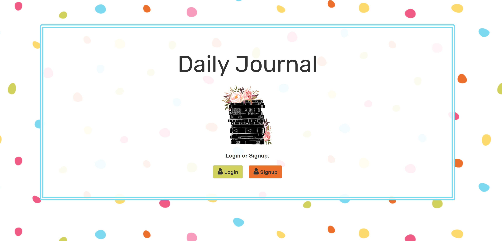
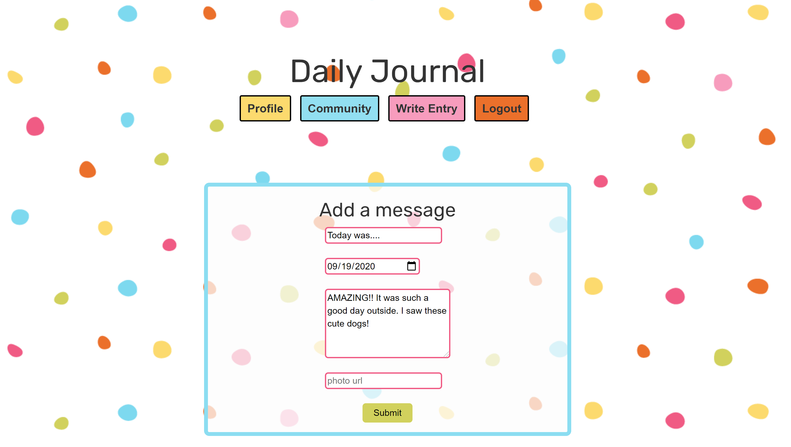
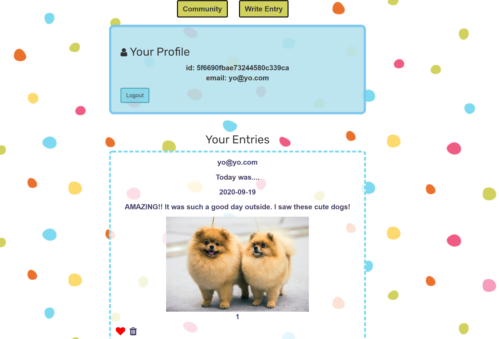

# How It's Made:
### Tech used: 
HTML, CSS, JS, EJS, MongoDB, PassPort & Mongoose

### Lessons Learned:
Learned how to incorporate url input so user could be able to place img address along with journal entry.

## Installation

1. Clone repo
2. run `npm install`

## Usage

1. run `npm run savage`
2. Navigate to `localhost:8080`

# Examples:

Take a look at these couple examples that I have in my own portfolio:

To-Do: https://github.com/Kim-Flores/ToDo-Express

Anime Forum: https://github.com/Kim-Flores/AnimeForum-Fullstack

Quotes: https://github.com/Kim-Flores/Quotes-Express
